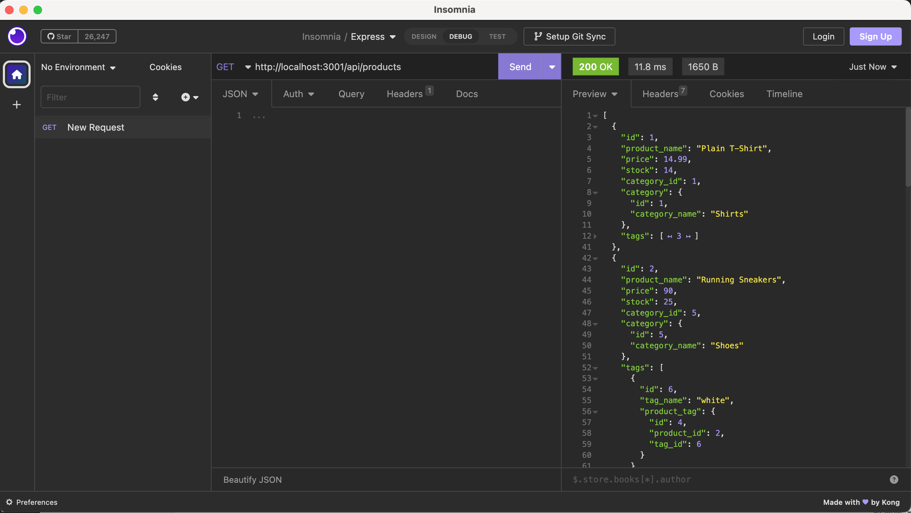
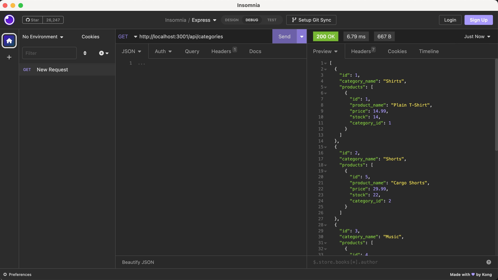
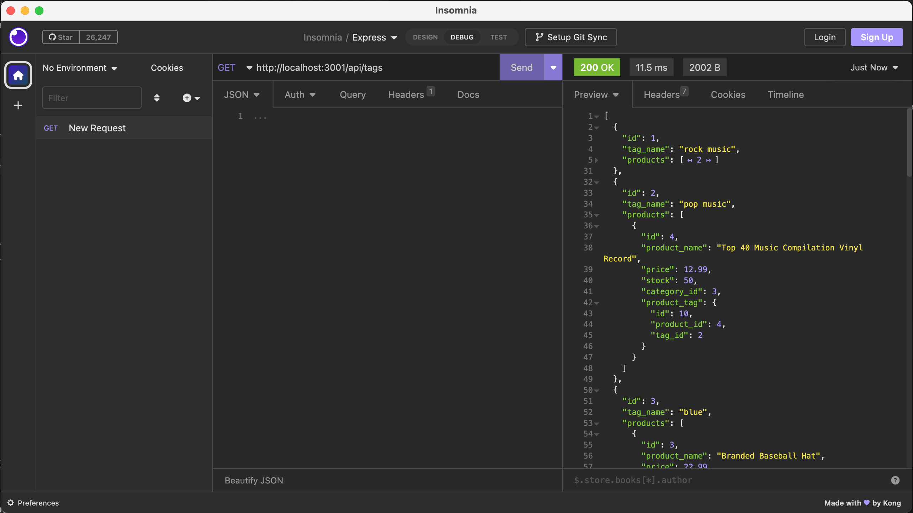

# e-commerce

## Description 

This is a back end e-commerce site for an internet retail company that utilizes Express.js API to use Sequelize to interact with a MySQL database.

The application can be invoked by using 'node server.js' command. 

* This is a functional Express.js API, where if you add your database name, MySQL username, and MySQL password to an environment variable file then you are able to connect to a database using Sequelize.
* When you enter schema and seed commands then a development database is created and is seeded with test data.
* When you enter the command to invoke the application then the server is started and the Sequelize models are synced to the MySQL database.
* When you open API GET routes in Insomnia for categories, products, or tags then the data for each of these routes is displayed in a formatted JSON. The GET routes are implemented for 'get all' and 'get by id', they also get the associated data with them.
* When you test API POST, PUT, and DELETE routes in Insomnia for categories, products, or tags then you are able to successfully create, update, and delete data in your database for the respective categories, products, or tags. The POST route will create a new product, category or tag. The PUT and DELETE routes take the 'id' parameter to update or delete a particular product, category or tag.

## Features

* The features are same as explained in the description, please refer above.

## Installation

N/A

## Screenshot

## Link to the GitHub repo of the application

https://github.com/suvarna28/e-commerce

## Link to the walkthrough video demonstrating the functionality of the application

## Credits

* Our TA, Sebastian Fave for answering homework related doubts and helping in resolving query related questions. 
* Stackoverflow and W3schools for syntax and examples. 
